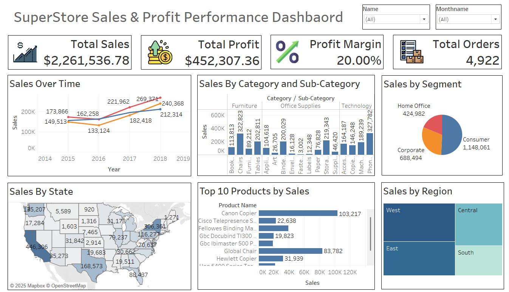

# 📊 Superstore Sales & Profit Performance Dashboard

## 🚀 Overview

In the world of retail, **data-driven decisions** are the difference between growth and stagnation. This project showcases a **comprehensive Tableau dashboard** that transforms raw sales data into **clear, actionable insights**.

The dashboard tells the story of a fictional **Superstore**, revealing:
- How sales and profit evolve over time
- Which regions and products drive growth
- What segments contribute most to business success

> 📌 Designed with interactivity, clarity, and real-world decision-making in mind, this dashboard empowers analysts, managers, and stakeholders to unlock the *why* behind the numbers.

---

## 📦 Dataset Details

- **Source**: [Kaggle - Sales Forecasting Dataset](https://www.kaggle.com/datasets/rohitsahoo/sales-forecasting)
- **Records**: ~10,000 rows
- **Key Columns**:
  - `Order ID`, `Product Category`, `Sub-Category`
  - `Sales`, `Profit`, `Discount`, `Quantity`
  - `Order Date`, `Ship Date`
  - `Segment`, `Region`, `State`, `Customer ID`

🧹 Data Cleaning and preprocessing were performed in **Excel** before visualization.

---

## 📌 Dashboard Highlights

### 🔍 Key Metrics (KPIs)
- **Total Sales**, **Total Profit**, **Order Count**
- **Profit Margin** calculated dynamically

### 📈 Sales Over Time
- Yearly and monthly trend lines to detect seasonality and growth patterns

### 🛍️ Sales Breakdown
- By **Product Category** and **Sub-Category**
- Identify underperforming or high-potential items

### 🗺️ Regional Insights
- **Map visuals** show sales and profits across States and Regions

### 👥 Segment-wise Behavior
- Compare Consumer, Corporate, and Home Office segments

### 🏆 Top 10 Products
- Ranked by sales for quick strategic focus

### 🧠 Interactive Filters
- Slice data by **Month Name** and **Customer Name**

---

## 🛠️ Tools & Technologies Used

| Tool          | Purpose                            |
|---------------|------------------------------------|
| **Tableau**   | Visualization & Dashboard Building |
| **MS Excel**  | Data Cleaning & Structuring        |
| **Kaggle**    | Source of Retail Dataset           |

---

## 🧪 How to Explore This Dashboard

1. **Download Dataset**  
   → [Sales Forecasting Dataset on Kaggle](https://www.kaggle.com/datasets/rohitsahoo/sales-forecasting)

2. **Open Tableau Desktop or Tableau Public**

3. **Connect to the Excel File**  
   Ensure correct sheet and data types

4. **Open the Dashboard File**  
   If available (`.twb` / `.twbx`), simply double-click to explore

5. **Interact and Analyze**  
   Use built-in filters to dive into specific customer names or months

---

## 👤 About Me

**Vedika Sankhe**  
🎓 Aspiring Data Analyst | 📊 Tableau & Power BI Enthusiast | 💡 Turning Numbers into Narratives  

🔗 [LinkedIn](https://www.linkedin.com/in/vedika-sankhe-707700317/)  
📁 [GitHub Portfolio](https://github.com/VedikaaSankhe)

---

## 💬 Feedback & Contributions

If you have ideas to improve this dashboard, feel free to open an issue or submit a pull request.  
Collaboration is welcome!

---

## 📄 License

This project is open-source and available under the [MIT License](LICENSE).
